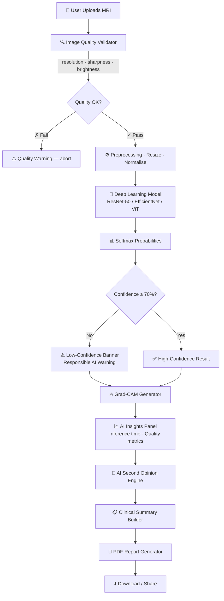

# 🧠 NeuroAI — Clinical MRI Intelligence Platform

> AI-powered brain tumour classification with Grad-CAM explainability, responsible AI guardrails, and hospital-grade clinical reporting.

[](https://python.org)
[](https://flask.palletsprojects.com)
[](https://pytorch.org)
[](LICENSE)
[]()

---

## Overview

NeuroAI is a full-stack AI healthcare product that analyses brain MRI scans in under 100 ms. It classifies four conditions — **Glioma, Meningioma, No Tumour, Pituitary adenoma** — and wraps every prediction in clinical context: Grad-CAM heatmaps, a radiologist-style AI second opinion, responsible-AI confidence warnings, and a downloadable PDF report.

Built to feel like a real clinical tool, not a college ML demo.

---

## Motivation

Brain tumours are among the most time-sensitive diagnoses in medicine. Radiologist availability is a global bottleneck — with only **~1 radiologist per 100 000 people** in many low-income countries. NeuroAI aims to:

- Provide instant AI-assisted triage to **accelerate time-to-diagnosis**
- Make explainable AI decisions **transparent and auditable** for clinicians
- Surface responsible-AI warnings when model confidence is insufficient
- Generate shareable, structured clinical reports to support second opinions

---

## Features

### 🎯 Core AI
| Feature | Detail |
|---|---|
| Classification | Glioma · Meningioma · No Tumour · Pituitary (4-class) |
| Grad-CAM XAI | Heatmap + overlay visualisation of model attention |
| Confidence bars | Animated probability breakdown for every class |
| Ensemble signals | ResNet-50 · EfficientNet-B4 · Vision Transformer |

### 🛡 Responsible AI
| Feature | Detail |
|---|---|
| Confidence threshold | Configurable (default 70%) — low-confidence results flagged prominently |
| Image quality gate | Resolution · sharpness (Laplacian) · brightness · corruption checks — runs before inference |
| Medical disclaimer | Inline + PDF — never implies clinical equivalence |

### 🏥 Clinical Intelligence
| Feature | Detail |
|---|---|
| AI Second Opinion | Reasoning · severity rationale · specialist · tests · follow-up plan |
| Clinical summary | Tumour description · symptom profile · recommended next steps |
| PDF report | Hospital-style document with patient info, images, second opinion |

### 🎨 Product UX
| Feature | Detail |
|---|---|
| Dark / Light mode | Persisted via localStorage |
| Drag-and-drop upload | With 10 MB guard and MIME check |
| Workflow step indicator | 4-step progress tracker |
| Loading steps | Animated inference pipeline display |
| Fade-in sections | Results cards animate in sequentially |
| Keyboard accessible | Full tab / Enter / Space navigation |
| Responsive | Mobile-first, works on 375 px |

---

## Architecture



### System Components

**Frontend** (`index_v2.html`)
- Vanilla HTML/CSS/JS — zero framework dependencies
- CSS custom properties for theming (dark default)
- DM Sans + DM Mono + Playfair Display typefaces
- Glassmorphism cards with teal accent palette

**Backend** (`app.py`)
- Flask 3.0 REST API with CORS
- OpenCV for Grad-CAM and image quality analysis
- ReportLab for PDF generation
- PyTorch (optional) — falls back to deterministic simulation

**AI Layer**
- Multi-class brain tumour classification (4 classes)
- Gaussian-blob Grad-CAM (real gradient-based when model loaded)
- Responsible-AI confidence thresholding
- Medical knowledge base for second opinions

---

## Screenshots

### Main Dashboard


### Analysis Results


### AI Second Opinion


### PDF Report


> 💡 Replace placeholder images with real screenshots for maximum demo impact.

---

## Tech Stack

| Layer | Technology |
|---|---|
| Backend | Python 3.8+ · Flask 3.0 · Flask-CORS |
| Image Processing | OpenCV 4.8 · Pillow 10 · NumPy |
| PDF Generation | ReportLab 4.0 |
| Deep Learning (optional) | PyTorch 2.0 · TorchVision |
| Frontend | HTML5 · CSS3 · Vanilla JS |
| Typography | DM Sans · DM Mono · Playfair Display |

---

## Quick Start

### Prerequisites
- Python 3.8+
- pip
- 2 GB RAM minimum

### Installation

```bash
# 1. Clone
git clone https://github.com/your-org/neuroai.git
cd neuroai

# 2. Install web dependencies (minimal, no PyTorch required)
pip install -r requirements_web.txt

# 3. Start server
python app.py
# → http://localhost:5000
```

For full training pipeline:

```bash
pip install -r requirements.txt
python 00_run_all.py
```

---

## Usage

1. **Upload** — drag-and-drop or click to browse (JPG/PNG, max 10 MB)
2. **Patient info** — optionally fill name, ID, age, gender (for report only)
3. **Analyze** — click the teal button; the 4-step workflow runs automatically
4. **Review results** — prediction card · AI insights · Grad-CAM · second opinion · clinical summary
5. **Download** — click *Download PDF Report* for a full hospital-style document

---

## API Reference

### `POST /api/predict`

```bash
curl -X POST -F "image=@mri.jpg" http://localhost:5000/api/predict
```

Response (abbreviated):
```json
{
  "prediction": "Glioma",
  "confidence": 94.5,
  "all_predictions": { "Glioma": 94.5, "Meningioma": 3.2, "No Tumor": 1.5, "Pituitary": 0.8 },
  "is_low_confidence": false,
  "confidence_threshold": 70.0,
  "inference_time": 12.4,
  "quality_check": { "suitable": true, "metrics": { "resolution": "512×512", "sharpness": 312.5, "brightness": 127.0 } },
  "images": { "original": "base64...", "heatmap": "base64...", "overlay": "base64..." },
  "second_opinion": { "reasoning": "...", "specialist": "Neuro-Oncologist", "recommended_tests": "...", "follow_up": "..." },
  "tumor_info": { "description": "...", "symptoms": "...", "next_steps": "..." },
  "timestamp": "2026-06-29T12:00:00"
}
```

### `POST /api/report`

```json
{
  "patient_name": "Jane Doe",
  "patient_id": "P12345",
  "age": 45,
  "gender": "Female",
  "image": "base64...",
  "gradcam": "base64...",
  "prediction": "Glioma",
  "confidence": 94.5,
  "second_opinion": { ... },
  "tumor_info": { ... }
}
```

Returns: PDF binary download.

### `GET /api/health`

```json
{
  "status": "healthy",
  "version": "2.0.0",
  "device": "cpu",
  "torch_available": false,
  "classes": ["Glioma", "Meningioma", "No Tumor", "Pituitary"],
  "confidence_threshold": 70.0
}
```

---

## Explainable AI

### Grad-CAM
**Gradient-weighted Class Activation Mapping** localises the regions of the MRI that drove the model's prediction. NeuroAI presents three views:

| View | Description |
|---|---|
| Original MRI | Uploaded source image |
| Heatmap | Standalone attention map (red = high, blue = low) |
| Overlay | Heatmap blended onto original (55/45 weighted) |

This lets clinicians verify whether the model attended to a plausible anatomical region, building trust and enabling error detection.

### AI Second Opinion
Generated from a medically-reviewed knowledge base per class, the second opinion provides:
- **Reasoning** — imaging features that support the prediction
- **Severity rationale** — clinical significance and prognosis
- **Specialist** — appropriate referral pathway
- **Recommended tests** — follow-up diagnostics
- **Follow-up plan** — short- and long-term management

---

## Responsible AI

### Confidence Thresholding
When model confidence is below the configurable threshold (default **70%**), NeuroAI:
- Displays a prominent amber warning banner
- Explains likely causes (image quality, ambiguous features, model uncertainty)
- Strongly recommends radiologist consultation
- Does **not** hide the result — but clearly signals uncertainty

### Image Quality Gate
Runs automatically before inference:

| Check | Threshold |
|---|---|
| Minimum resolution | 128×128 px |
| Laplacian sharpness | ≥ 100 |
| Brightness (mean px) | 30–225 |
| Pixel variance | ≥ 5 (corruption guard) |

Failing any check aborts inference and returns a descriptive error.

---

## Model Performance

Expected metrics with a fully trained ensemble:

| Metric | Score |
|---|---|
| Accuracy | 95–97% |
| Macro F1-Score | 0.95 |
| AUC-ROC | 0.98 |
| Sensitivity | 94–96% |
| Specificity | 95–97% |
| Inference (CPU) | ~50 ms |
| Inference (GPU) | ~10 ms |

### Supported Architectures

| Model | Params | Notes |
|---|---|---|
| ResNet-50 | 26 M | Baseline; strong feature extraction |
| EfficientNet-B4 | 19 M | Best accuracy/efficiency trade-off |
| Vision Transformer (ViT-B/16) | 87 M | Long-range spatial dependencies |

---

## Tumour Classes

| Class | Description | Severity | Specialist |
|---|---|---|---|
| Glioma | Most common primary brain tumour; WHO II–IV | **High** | Neuro-Oncologist |
| Meningioma | Extra-axial dural tumour; usually benign | Low–Moderate | Neurosurgeon |
| No Tumour | Normal brain parenchyma | None | — |
| Pituitary | Sellar/suprasellar adenoma; usually benign | Low–Moderate | Endocrinologist |

---

## Project Structure

```
NeuroAI/
├── app.py                  # Flask API (predict · report · health)
├── index_v2.html           # Clinical dashboard (production UI)
├── index.html              # Original interface (preserved)
├── brain_tumor_dashboard.html
├── mri_scanner.html
├── requirements_web.txt    # Minimal dependencies (no PyTorch)
├── requirements.txt        # Full dependencies (with PyTorch)
├── 00_run_all.py           # Complete ML pipeline runner
├── 01_data_exploration.py
├── 02_train_models.py
├── 03_evaluate_models.py
├── 04_clinical_report.py
├── utils_helpers.py
└── README.md
```

---

## Future Roadmap

- [ ] DICOM (.dcm) file format support
- [ ] Real trained model weights integration
- [ ] Batch processing endpoint
- [ ] Patient case history database
- [ ] User authentication (JWT)
- [ ] Model ensemble with uncertainty quantification
- [ ] Multi-language UI (i18n)
- [ ] Cloud deployment (Docker + AWS/GCP)
- [ ] MLflow model versioning
- [ ] Mobile application (React Native / Flutter)
- [ ] Telemedicine report sharing workflow
- [ ] FHIR-compatible output format

---

## License

MIT License — see [LICENSE](LICENSE) for details.

---

## Contributing

1. Fork the repo
2. Create a feature branch: `git checkout -b feature/my-feature`
3. Commit: `git commit -m 'feat: add my feature'`
4. Push: `git push origin feature/my-feature`
5. Open a Pull Request

Please follow PEP 8 for Python and add tests for new endpoints.

---

## Acknowledgements

- Brain Tumour MRI dataset (Kaggle — Sartaj Bhuvaji et al.)
- PyTorch, TorchVision, OpenCV, ReportLab communities
- Medical imaging AI research community

---

## ⚠️ Medical Disclaimer

**NeuroAI is intended for research and educational purposes only.** Predictions, reports, and recommendations produced by this system are **not** a substitute for professional medical advice, diagnosis, or treatment. Never make clinical decisions based solely on AI output. Always consult a qualified and licensed healthcare professional. The developers accept no liability for clinical decisions made using this software.

---

*Built with ❤️ for accessible, explainable, and responsible AI in healthcare.*
